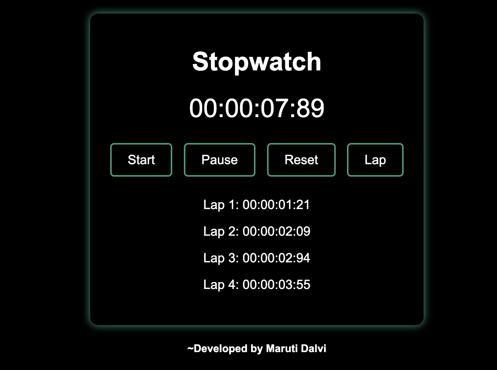

# Stopwatch

A simple and elegant stopwatch application built using HTML, CSS, and JavaScript. The stopwatch features start, pause, reset, and lap functionalities, with a visually appealing interface.

## Features

- **Start:** Begins the stopwatch timing.
- **Pause:** Pauses the stopwatch timing.
- **Reset:** Resets the stopwatch to 00:00:00:00.
- **Lap:** Records lap times.

## Demo

Check out the live demo: 

## Screenshots

## Technologies Used

- HTML
- CSS
- JavaScript

## Getting Started

To get a local copy up and running, follow these simple steps.

### Prerequisites

You need a any web browser to run this application.

### Installation

1. Clone the repository
   git clone https://github.com/maruti-dalvi-03/ProdigyInfoTech_WD_02.git

2. Open index.html in your web browser.
